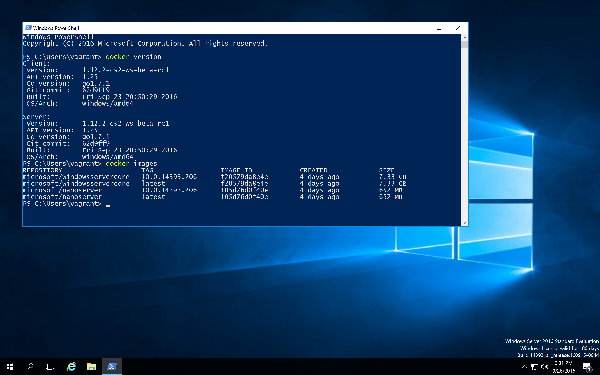
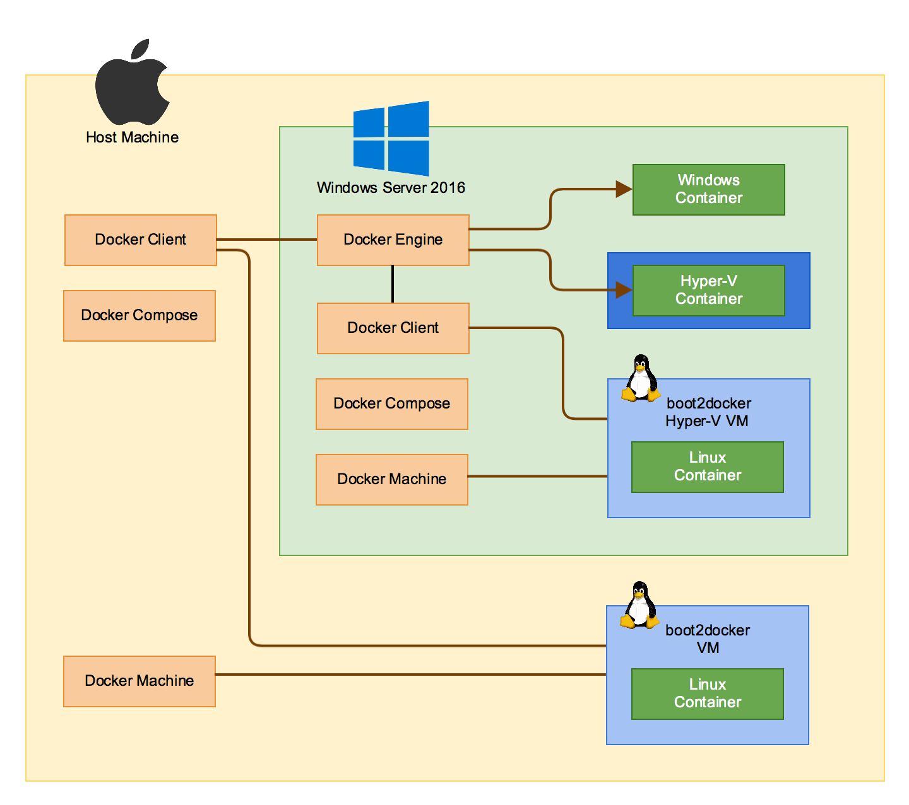

# docker-windows-box

This repo is a collection of various Vagrant environments to work with Windows Containers on a Windows Server 2019 or Windows 10 VM.

There are different Vagrantfiles for each scenario:

* `Vagrantfile` - Windows Server 2019 and Docker 18.09.0
* WSL 2
  * [`wsl2/server/Vagrantfile`](wsl2/server/README.md) - Windows Server Core, version 2004 with WSL 2
  * [`wsl2/windows10/Vagrantfile`](wsl2/windows10/README.md) - Windows 10, version 2004 with WSL 2
* [`lcow/Vagrantfile`](lcow/README.md) - Windows 10 with nightly Docker and LCOW enabled
* [`nano/Vagrantfile`](nano/README.md) - Test setup to have Docker engine installed in a Windows Nanoserver VM
* [`swarm-demo/Vagrantfile`](swarm-demo/README.md) - some Windows Server 2016 VM's in classical Docker Swarm
* [`swarm-mode/Vagrantfile`](swarm-mode/README.md) - some Windows Server 2016 VM's in Docker Swarm-mode and overlay network
* [`windows10/Vagrantfile`](windows10/README.md) - Windows 10 1809 and nightly Docker to test process isolation
* docker-machine test environments
  * [`docker-machine/Vagrantfile`](docker-machine/README.md) - Windows 10 with `docker-machine` installed to test with VMware Workstation
  * [`docker-machine-fusion/Vagrantfile`](docker-machine-fusion/README.md) - macOS 10.13 with `docker-machine` installed to test with VMware Fusion

## Introduction

This repo has started with a single Vagrantfile that is explained below. As you can see there are several interesting setups here as well in the sub folders.

Have a look at my blog posts how to [Setup a local Windows 2016 TP5 Docker VM](https://stefanscherer.github.io/setup-local-windows-2016-tp5-docker-vm/) and [Adding Hyper-V support to 2016 TP5 Docker VM](https://stefanscherer.github.io/adding-hyper-v-support-to-2016-tp5-docker-vm/) for more details. I also can recommend a more up to date guide [Getting started with Windows Containers](http://glennsarti.github.io/blog/getting-started-with-windows-containers/) by [@glennsarti](https://github.com/glennsarti)



After provisioning the box has the following tools installed:

* Windows Server 2019 with Docker Engine 18.09.0 and client
* docker-machine 0.16.0
* docker-compose 1.23.0
* (Docker Tab completion for PowerShell (posh-docker))
* Chocolatey
* Git command line
* Git Tab completion for PowerShell (posh-git)
* SSH client

Optionally you can create a Hyper-V Docker Linux machine and have a multi architecture experience in one VM.

Tested with Vagrant 2.1.2, VMware Fusion Pro 10.1.3 on a MacBookPro with Retina display. The Vagrant box will be started in fullscreen mode also with Retina support.

You can learn and play a lot of scenarios with it:



Future work will be a Docker Swarm with both Linux and Windows Docker Engines...

## Get the base box

First register to [evaluate Windows 2019](https://www.microsoft.com/evalcenter/evaluate-windows-server-2019), but you don't need to download the ISO manually.

The Vagrant base box is available in Vagrant Cloud https://app.vagrantup.com/StefanScherer, these are all eval versions of Windows Server 2019 or Windows 10.

Vagrant will download the base box if it's not available locally, a `vagrant box list` shows which boxes you already have downloaded.

## Install Vagrant reload plugin

As we need to reboot the VM once during the provisioning, you will need an additional Vagrant plugin

```bash
vagrant plugin install vagrant-reload
```

## Spin up the box

To start the VM with [Vagrant](https://vagrantup.com) run this command

```bash
vagrant up
```

You only have to logout and login once to have the Docker tools in user vagrant's PATH.

## Create some Windows Docker Container images

You may clone my [dockerfiles-windows](https://github.com/StefanScherer/dockerfiles-windows) repo and create some container images.

```
git clone https://github.com/StefanScherer/dockerfiles-windows
cd dockerfiles-windows
cd node
.\build.ps1
```

## Test the nightly Windows Docker Engine

You can update the Docker Engine with the script

```
C:\update-container-host.ps1
```

This will stop the Docker service, download the nightly build from https://master.dockerproject.org and restart the service.

## Create a Linux Docker machine in Hyper-V

If you want to try out multi architecture you also use `docker-machine` to create a Linux Docker Engine running in Hyper-V.
I have prepared a script that will set up everything as there are some known issues.

```
C:\vagrant\scripts\create-hyperv-linux-docker-machine.ps1
```

This PowerShell script creates a Docker machine and updates Docker Engine to the latest so that the Windows Docker client is able to communicate with the Linux Docker Engine.

### Use the Linux Docker machine

Open a PowerShell terminal as an administrator and select the Linux Docker machine with

```
docker-machine env --shell powershell | iex
```

Now run your first busybox container with

```
docker run -it busybox uname -a
```

## Windows Docker Swarm demo

See subdirectory [swarm-demo](swarm-demo/README.md)

## Use Vagrant to control your box

From your host control your Vagrant box with the usual Vagrant workflow:

* vagrant up
* vagrant halt
* vagrant destroy -f
* vagrant snap take
* vagrant snap rollback
* ...

Writing the installation script for the Hyper-V Docker machine the snapshot functions helped me a lot to test the script again and again.
