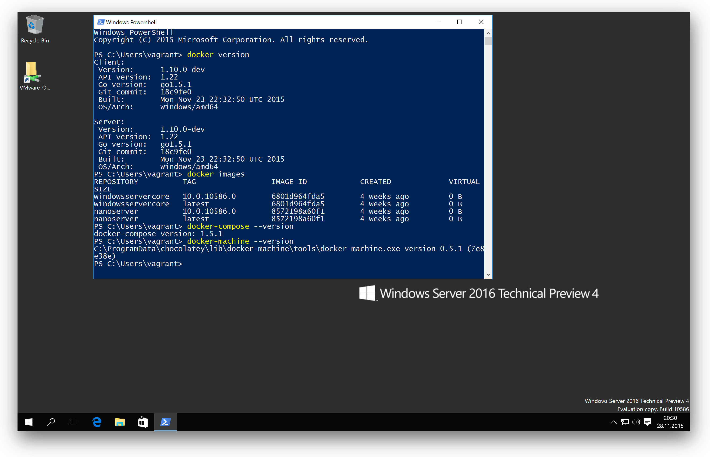

# docker-windows-box

This is a Vagrant box to test Windows Docker Containers on a Windows Server 2016 TP4.



After provisioning the box has the following tools installed:

* Docker TP4 engine and client
* docker-machine 0.7.0
* docker-compose 1.7.0
* (Docker Tab completion for PowerShell (posh-docker))
* Chocolatey
* Git command line
* Git Tab completion for PowerShell (posh-git)
* SSH client

Optionally you can create a Hyper-V Docker Linux machine and have a multi architecture experience in one VM.

Tested with VMware Fusion 7.1.3 on a MacBookPro with Retina display. The Vagrant box will be started in fullscreen mode also with Retina support.

You can learn and play a lot of scenarios with it:


Future work will be a Docker Swarm with both Linux and Windows Docker Engines...

## Get the base box

First register to [evaluate Windows 2016 TP4](https://technet.microsoft.com/de-de/evalcenter/dn781243.aspx), but you don't need to download the ISO manually.

If you don't have the Vagrant `windows_2016_docker` base box you need to create it first with [Packer](https://packer.io). See my [packer-windows](https://github.com/StefanScherer/packer-windows) repo to build the base box.

To build the base box you have to run these commands on your host machine:

```
git clone https://github.com/StefanScherer/packer-windows
cd packer-windows
packer build --only=vmware-iso windows_2016_docker.json
vagrant box add windows_2016_docker windows_2016_docker_vmware.box
```

## Spin up the box

To start the VM with [Vagrant](https://vagrantup.com) run this command

```bash
vagrant up --provider vmware_fusion
```

You only have to logout and login once to have the Docker tools in user vagrant's PATH.

## Create some Windows Docker Container images

You may clone my [dockerfiles-windows](https://github.com/StefanScherer/dockerfiles-windows) repo and create some container images.

```
git clone https://github.com/StefanScherer/dockerfiles-windows
cd dockerfiles-windows
cd node
.\build.bat
```

## Test the nightly Windows Docker Engine

You can update the Docker Engine with the script

```
C:\vagrant\scripts\update-nightly-docker.ps1
```

This will stop the Docker service, download the nightly build from https://master.dockerproject.org and restart the service.

## Create a Linux Docker machine in Hyper-V

If you want to try out multi architecture you also use `docker-machine` to create a Linux Docker Engine running in Hyper-V.
I have prepared a script that will set up everything as there are some known issues.

```
C:\vagrant\scripts\create-hyperv-linux-docker-machine.ps1
```

This PowerShell script creates a Docker machine and updates Docker Engine to the latest so that the Windows Docker client is able to communicate with the Linux Docker Engine.

### Use the Linux Docker machine

Open a PowerShell terminal as an administrator and select the Linux Docker machine with

```
docker-machine env --shell powershell | iex
```

Now run your first busybox container with

```
docker run -it busybox uname -a
```

## Windows Docker Swarm demo

See subdirectory [swarm-demo](swarm-demo/README.md)

## Use Vagrant to control your box

From your host control your Vagrant box with the usual Vagrant workflow:

* vagrant up
* vagrant halt
* vagrant destroy -f
* vagrant snap take
* vagrant snap rollback
* ...

Writing the installation script for the Hyper-V Docker machine the snapshot functions helped me a lot to test the script again and again.
