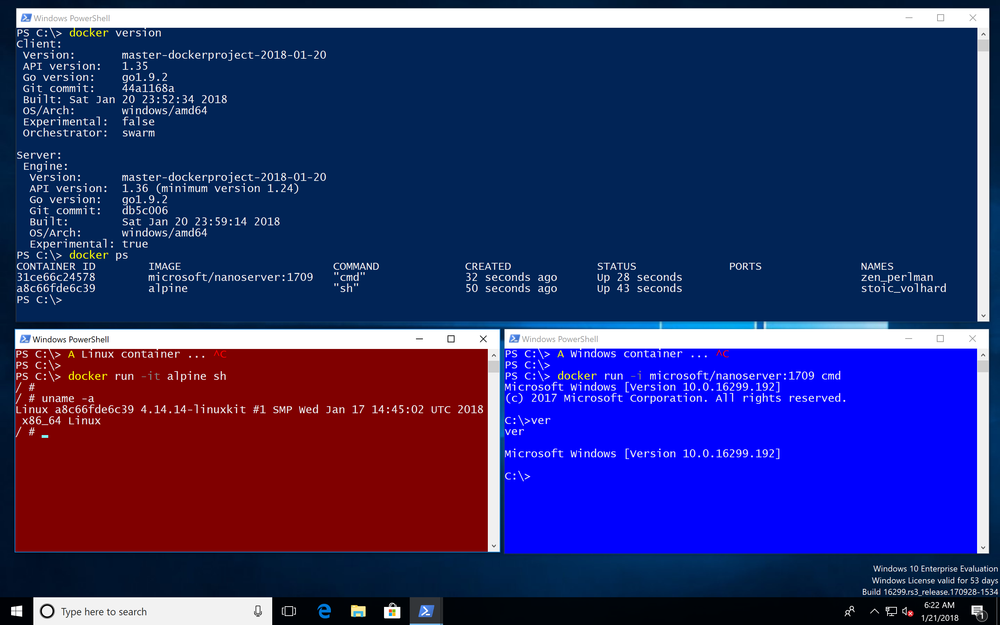

# LCOW

Linux Containers on Windows (LCOW) works on Windows 10 1709 and a Docker
engine that has the pull request [moby/moby#34859](https://github.com/moby/moby/pull/34859)
merged in.

At the moment we can use the nightly builds from [master.dockerproject.com](https://master.dockerproject.com).

To run Linux containers we also need a small Linux VM which is part of the Docker EE 17.10 Preview.



## Create the VM

```
vagrant up
```

## Run Windows containers

In the Windows 10 VM open a PowerShell terminal.

```
docker run microsoft/nanoserver:1709 cmd /c set
```

## Run Linux containers

At the moment you need to specify the `--platform` option to pull Linux images.

```
docker pull --platform linux alpine
```

Once you have pulled Linux images you can run them without the `--platform` option.

```
docker run alpine uname -a
```

## Bind mount a volume

You can bind mount a volume into Linux and Windows containers. The following example shares a folder from the host with a Linux and Windows container.

First create a folder on the Windows 10 host:

```
cd \
mkdir host
```

### Run a Linux container

```
docker run -it -v C:\host:/test alpine sh
```

In the Linux container create a file

```
$ uname -a > test/hello-from-linux.txt
```

### Run a Windows container

```
docker run -i -v C:\host:C:\test microsoft/nanoserver:1709 cmd
```

In the Windows container create a file

```
ver > test\hello-from-windows.txt
```
