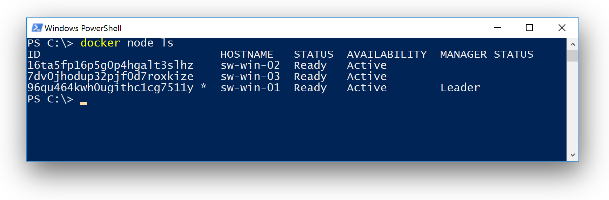
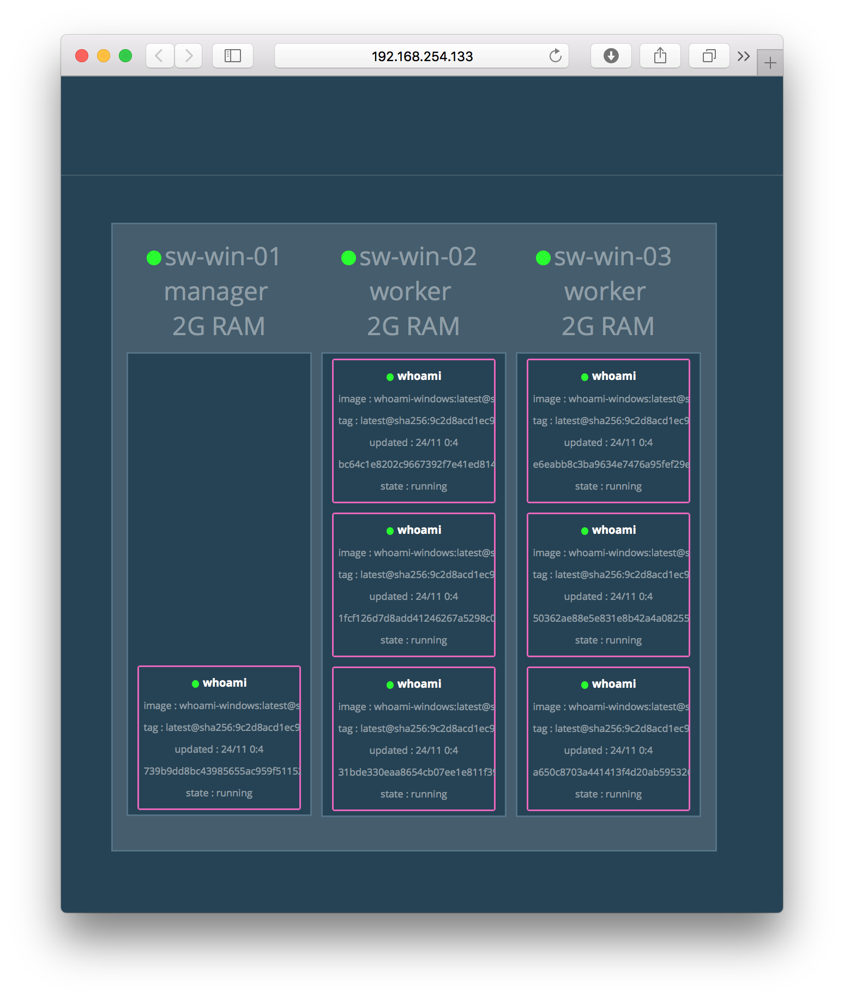
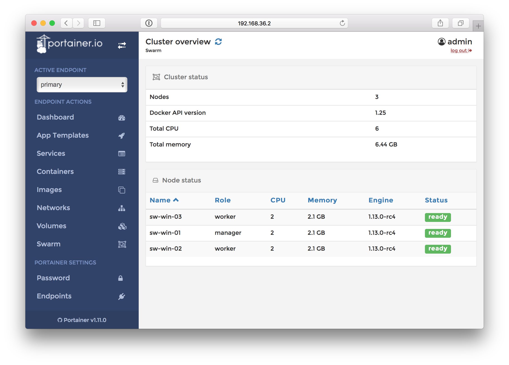

# Windows Docker swarm-mode

This is a local setup using Vagrant with VMware Fusion to demonstrate a Windows Docker swarm-mode.
See also
  - https://docs.microsoft.com/en-us/virtualization/windowscontainers/manage-containers/swarm-mode for latest features in Windows 10 Insider build 15031.
  - https://blogs.technet.microsoft.com/virtualization/2017/02/09/overlay-network-driver-with-support-for-docker-swarm-mode-now-available-to-windows-insiders-on-windows-10/

## Vagrant boxes

There are three VM's with the following internal network and IP addresses:

| VM        | IP address   | Memory |
|-----------|--------------|--------|
| sw-win-01 | 192.168.36.2 | 2GB    |
| sw-win-02 | 192.168.36.3 | 2GB    |
| sw-win-03 | 192.168.36.4 | 2GB    |

Depending on your host's memory you can spin up one or more Windows Server VM's.

## Swarm Manager

The `sw-win-01` is the Swarm manager.

## Swarm worker

The `sw-win-02` and `sw-win-03` are Swarm workers.



## Example usage: Overlay network

The folder `demo` contains some helper scripts to use the overlay network. Beginning with Windows Server 2016 update 1066 or Windows 10 Creators Update you can use overlay network.


Open a PowerShell window in the `sw-win-01` machine and create a network first

```
PS C:\> docker network create --driver=overlay sample
```

```
PS C:\> docker service create --name=whoami --endpoint-mode dnsrr --network=sample stefanscherer/whoami-windows:latest
```

Check the service

```
PS C:\> docker service ls
ID            NAME    MODE        REPLICAS  IMAGE
eptkxbn1gce5  whoami  replicated  1/1       stefanscherer/whoami-windows:latest
```

Then scale up the service

```
PS C:\> docker service scale whoami=10
whoami scaled to 10
PS C:\> docker service ls
ID            NAME    MODE        REPLICAS  IMAGE
eptkxbn1gce5  whoami  replicated  6/10      stefanscherer/whoami-windows:latest
PS C:\> docker service ls
ID            NAME    MODE        REPLICAS  IMAGE
eptkxbn1gce5  whoami  replicated  6/10      stefanscherer/whoami-windows:latest
PS C:\> docker service ls
ID            NAME    MODE        REPLICAS  IMAGE
eptkxbn1gce5  whoami  replicated  10/10     stefanscherer/whoami-windows:latest
```

Test overlay network from another service

```
PS C:\> docker service create --name=askthem-dnscache-disabled --network=sample stefanscherer/askthem-windows:dnscache-disabled
```

Then check the output of the service

```
PS C:\> docker service logs askthem-dnscache-disabled
askthem-dnscache-disabled.1.e3q8uyeg4fuf@sw-win-01    | I'm eaaf40a6cc7e
askthem-dnscache-disabled.1.e3q8uyeg4fuf@sw-win-01    |
askthem-dnscache-disabled.1.e3q8uyeg4fuf@sw-win-01    | I'm 0816ee24a03d
askthem-dnscache-disabled.1.e3q8uyeg4fuf@sw-win-01    |
askthem-dnscache-disabled.1.e3q8uyeg4fuf@sw-win-01    | I'm b231230d8c73
askthem-dnscache-disabled.1.e3q8uyeg4fuf@sw-win-01    |
askthem-dnscache-disabled.1.e3q8uyeg4fuf@sw-win-01    | I'm eaaf40a6cc7e
askthem-dnscache-disabled.1.e3q8uyeg4fuf@sw-win-01    |
askthem-dnscache-disabled.1.e3q8uyeg4fuf@sw-win-01    | I'm eaaf40a6cc7e
askthem-dnscache-disabled.1.e3q8uyeg4fuf@sw-win-01    |
```

As you can see sometimes the response comes from the other Docker host.

## Visualizer

Open a PowerShell window on the `sw-win-01` machine and run the script

```
C:\vagrant\scripts\run-visualizer.ps1
```

Now open a browser to see the visualizer UI. I use the IP address of the manager VM and open a browser on my host machine.



## Portainer

Open a PowerShell window on the `sw-win-01` machine and run the script

```
C:\vagrant\scripts\run-portainer.ps1
```

Now open a browser to see the Portainer UI. Portainer is started as a Docker service. At the
moment you can't use `--publish` on Windows. So we have to pick the IP address of the container
to open it in a browser. Run the helper script

```
C:\vagrant\scripts\open-portainer-ui.ps1
```



With both Visualizer and Portainer you could demonstrate scaling services


