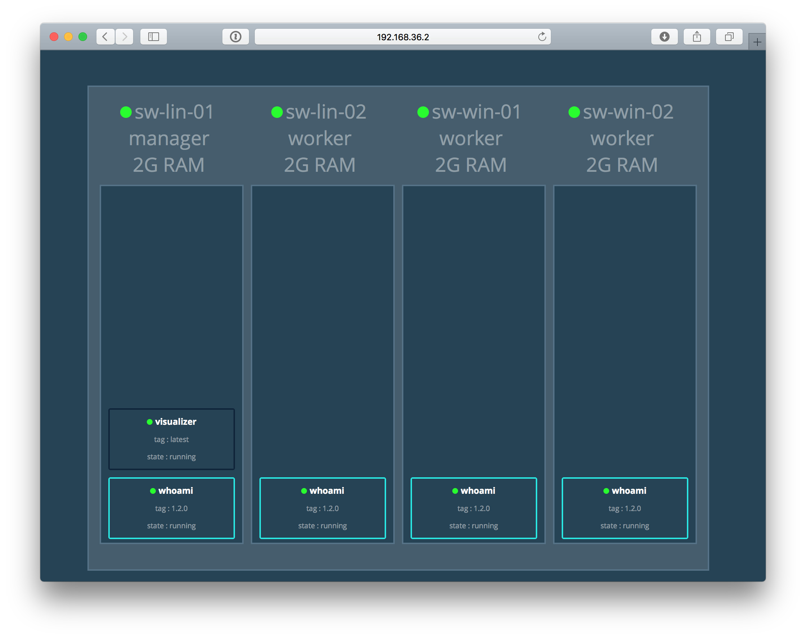
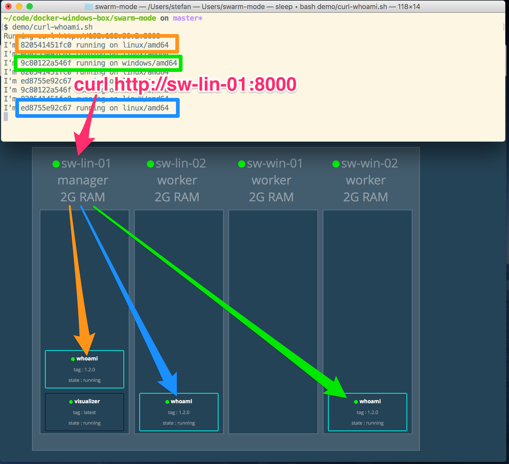

# Mixed Linux and Windows Docker swarm-mode

This is a local setup using Vagrant with VMware Fusion to demonstrate a mixed Linux and Windows Docker swarm-mode.


## Vagrant boxes

There are four VM's with the following internal network and IP addresses:

| VM        | IP address   | Memory | Type    |
|-----------|--------------|--------|---------|
| sw-lin-01 | 192.168.36.2 | 2GB    | Manager |
| sw-lin-02 | 192.168.36.3 | 2GB    | Worker  |
| sw-win-01 | 192.168.36.4 | 2GB    | Worker  |
| sw-win-02 | 192.168.36.5 | 2GB    | Worker  |

To create the four node cluster run

```
vagrant up
```

Depending on your host's memory you may want to spin up only two nodes to have a minimal Linux and Windows Server cluster.

```
vagrant up sw-lin-01 sw-win-01
```


## Swarm Manager

The node `sw-lin-01` is the Swarm manager.

## Swarm worker

The nodes `sw-lin-02`, `sw-win-01` and `sw-win-01` are Swarm workers.

## Open Visualizer

When spinning up the manager node it also starts the Docker swarm visualizer as a service. You can then open the visualizer with

```
open http://192.168.36.2:8080
```



## Example usage: Overlay network

The folder `demo` contains some helper scripts to use the overlay network. Beginning with Windows Server 2016 update 1066 or Windows 10 Creators Update you can use overlay network.

The overlay network also works in a mixed Linux and Windows Docker swarm.

### Create whoami service

Log into the manager node with `vagrant ssh sw-lin-01` and start the service with `docker service create --name=whoami -p 8000:8000 -e PORT=8000 stefanscherer/whoami:1.2.0`

Or just run the helper script from your host machine

```
demo/start-whoami.sh
```

### Check whoami service with curl

You can access the whoami service from your host with `curl http://192.168.36.2:8000` and it should respond with the hostname of the container and the operating system.

There is a helper script that will curl twice per second. Run this script in a second terminal.

```
demo/curl-whoami.sh
```

## Scale up

Log into the manager node and run `docker service scale whoami=4` to scale up the service.

Or use the helper script

```
demo/scale-whoami.sh 4
```


This is an example with `docker swarm scale whoami=3` getting responses from both Linux and Windows nodes:


## Caveats

- I have a problem with Docker 17.05.0-ce-rc2 as the routing mesh doesn't seem to work. The rc1 still works.
- I have to reboot the Windows worker nodes once to make the overlay network work. Without that reboot the curl times out when the round robin wants to connect to one of the Windows nodes.
